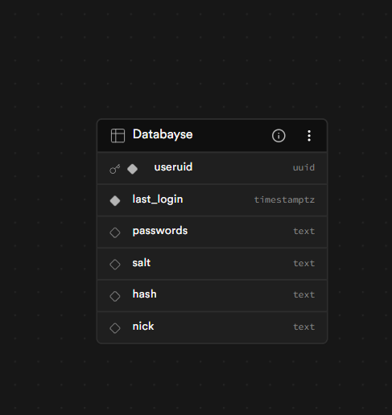

OneStore Unify is a web-based password manager that allows you to store all your passwords in one place. Securely. Accessible from anywhere in the world.

## Tech Stack

- Node.js (tested with v24.14.1)
- Express
- EJS (server-side views)
- Supabase (Postgres + Auth)
- Built-in Node `crypto` for encryption
- random-words for passphrase generation
- cookie-parser, body-parser for request handling

## Supabase Database

## Contribution

> If you'd like to contribute, I would be more than happy to include it in the project

1. Fork the repository and create a feature branch: `git checkout -b feat/my-change`
2. Install dependencies: `npm install`
3. Run the app locally: `node index.js` (or your preferred dev runner)
4. Make changes, open a pull request with a short description of the change.
